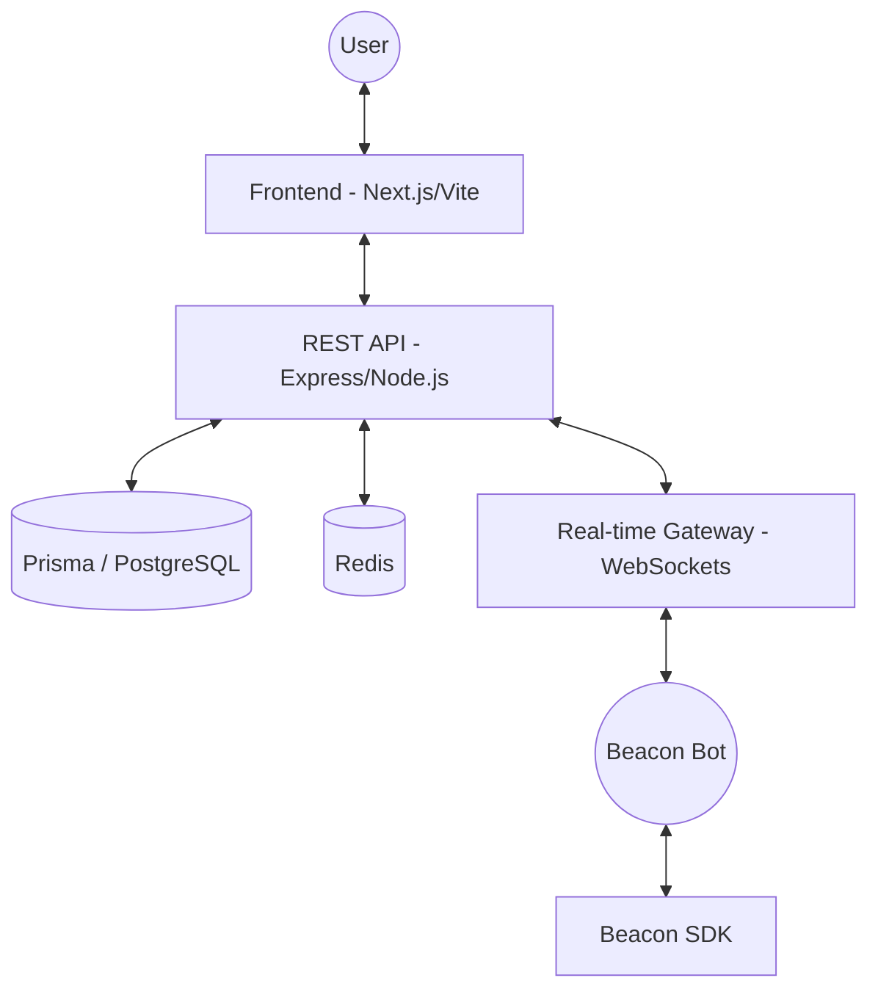

# 📡 Beacon — The Evolution of Communication

**Zero-Barrier. Developer-First. Privacy-Centric.**

Beacon is a next-generation communication platform designed to dismantle the barriers of modern messaging. No subscriptions, no paywalls, and no data harvesting. Just high-performance, secure communication with a world-class developer ecosystem.

---

## 🚀 Key Features

### 💎 Premium for Everyone
- **HD Streaming & Video** — Unlimited HD screen sharing and voice calls for all users at no cost.
- **Earned Identity** — Customize your profile with themes, animated banners, and exclusive badges earned through activity, not credit cards.
- **Persistent Voice** — Reliable, low-latency voice channels with automatic state synchronization.

### 🤖 Intelligent Bot Ecosystem
- **Universal SDK** — Build anything from simple utility bots to complex AI integrations using `beacon-sdk`.
- **Bot-to-User DMs** — Bots- **Verification**: 6-digit codes sent via email (expires in 30 minutes).
- **Official Emails**:
  - `noreply@beacon.qzz.io` (System notifications)
  - `support@beacon.qzz.io` (User support)
- **Seamless Server Invites** — Add bots to your servers with just two clicks, managed via a robust permission system.

### 🛡️ Hardened Security
- **Secure Cloud Infrastructure** — Multi-cloud deployment (Railway + Cloudflare) with hardened CORS and CSRF protection.
- **AI-Powered Moderation** — Base-layer content filtering powered by ONNX and semantic rule engines.
- **Privacy First** — Your data belongs to you. Period.

---

## 🏗️ Architecture Overview



---

## 🛠️ Developer Quick Start

### Install the SDK
```bash
npm install beacon-sdk
```

### Create a simple DM Bot
```typescript
import { Client } from 'beacon-sdk';

const client = new Client({ token: 'your_bot_token' });

client.on('ready', () => {
  console.log('📡 Beacon Bot is live!');
});

client.on('messageCreate', async (message) => {
  if (message.content === '!dmme') {
    // New: Direct sendDM support in SDK v3.0.10+
    await client.sendDM(message.author.id, 'Hello from the Beacon SDK!');
  }
});

client.login();
```

---

## 📦 Monorepo Structure

- `apps/web`: The core web application (React + Framer Motion).
- `apps/server`: High-performance Express API and WebSocket gateway.
- `packages/sdk`: The official `beacon-sdk` for bot development.
- `packages/types`: Shared TypeScript definitions across the ecosystem.

---

## 📄 License & Proprietary Info
Beacon is proprietary software. The `beacon-sdk` is licensed under MIT.

**Built with ❤️ by RaftTheCrab**
*The future of communication is open, secure, and developer-first.*
